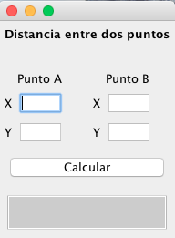
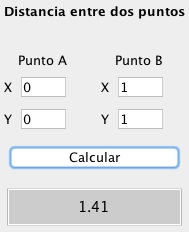
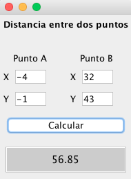

# Calculo de distancia entre dos puntos. Teorema de Pitágoras

Realiza el calculo entre dos puntos, con el teorema de pitágoras

## Vistas





## Download

[Download](dist/Distancia2.jar)

## Ejecutar

``` bash
java -jar dist/Distancia2.jar
```
